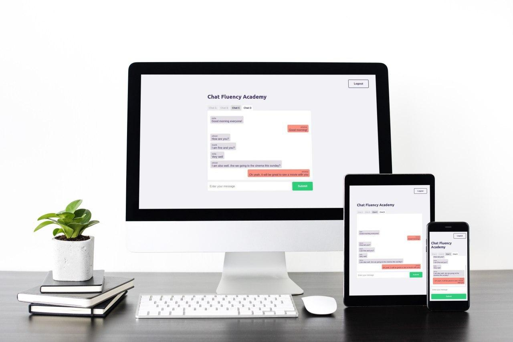

    

<h4 align="center">
  Project Developed as part of the Fluency Academy Full Stack Technical Challenge
</h4>

  <a href="#-technology">Technology</a>&nbsp;&nbsp;&nbsp;|&nbsp;&nbsp;&nbsp;
  <a href="#-project">Project</a>&nbsp;&nbsp;&nbsp;|&nbsp;&nbsp;&nbsp;
  <a href="#-how-to-use">How to use</a>

### 🚀 Technology

This project was developed with the following technologies:

- [Node.js](https://nodejs.org/en/)
- [React](https://reactjs.org)
- [TypeScript](https://www.typescriptlang.org/)

### 💻 Project

Chat Pubsub Fluency Academy is a multi-user system with authorization and authentication. It is a multi-user chat system using asynchronous [pub/sub](https://en.wikipedia.org/wiki/Publish%E2%80%93subscribe_pattern) pattern.

The full description of the project is available at: [Full Stack Technical Challenge](https://www.notion.so/Full-Stack-Backend-Frontend-5477ce83b51b4a44bd9528c50b48ed49)

### 🤔 How to use

- Download the repository on your machine;

- Inside the 'chat-pubsub-server' folder, execute the commands:

  - 'yarn' or 'npm install', to add the node_modules folder
  - 'yarn knex: migrate' or 'npm run knex: migrate' to create the database tables
  - 'yarn knex: seed' or 'npm run knex: seed' to fill the channel table (corresponding to the abstract authorization levels)
  - 'yarn dev' or 'npm run dev' to run the server

- Inside the 'chat-pubsub-frontend' folder, execute the commands:
  - 'yarn' or 'npm install', to add the node_modules folder
  - 'yarn start' or 'npm run start' to run the frontend
